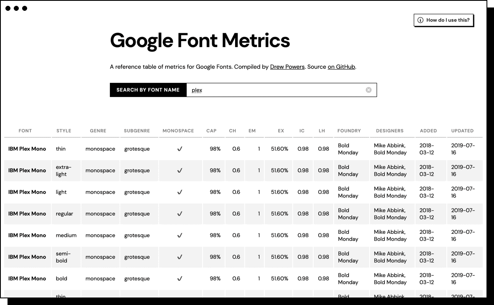

# Google Font Metrics

<p align="center">
  
</p>

Ever wonder exactly how big `1ex` is in an actual browser, based on the
[Google Font][google-fonts]you picked? What about `1ch`? Well, wonder no more!

**Metrics Measured for all Google Fonts**

- `cap`
- `ch`
- `ex`
- `em`
- `ic`
- `lh`

[view site][site]

## 🔧 Setup

```bash
npm i
```

## 💻 Commands

| Command           | Description                                                                                                                                         |
| :---------------- | :-------------------------------------------------------------------------------------------------------------------------------------------------- |
| `npm run measure` | Runs Puppeteer tests on all fonts in `fonts.yml`                                                                                                    |
| `npm run update`  | Adds any missing fonts from Google Fonts to `fonts.yml` (keeps existing data, but it will remove any fonts that have disappeared from Google Fonts) |

## 💁 FAQ

### How are these metrics generated?

In Puppeteer, we’ll load all the font files for a given Google Font family in
a headless Chromium browser. For each style (`400`, `400 italic`, `700`, `700 italic`, etc.), we’ll then generate a `<div>` on the page and set the width
to `1ex` and measure it with `element.getBoundingClientRect()`. Then we’ll
create a div below that and set its width to `1ch` and mesure that, then
`1em` and measure that, etc.

The neat part is that these aren’t mere estimations or font metadata; they’re
actual metrics generated (programatically) from a browser.

### Is it accurate?

Manually measuring the same method in my actual Chrome browser actually
produced the same numbers (no one’s more surprised than me). Granted, I
haven’t tested all the fonts, but IBM Plex Sans was dead-on.

### Why don’t `cap`, `ch`, `ic`, and `lh` work?

According to the spec, these units are supposed to work “if the metric data
is in the typeface,” whatever that means. Part of this experiment was finding
out what these values _really_ are. Even though it’s disappointing to see
`ch` literally always being ½ of `em`, it’s still valuable to see
comprehensive data on it in the table.

### Can you test non-Google font files?

Obviously for licensing reasons, no proprietary web fonts are part of this
repo. If you’d like for me to set it up for local webfonts, [open an
issue][issue]!

My next goal is trying to see if Puppeteer can measure the true cap height,
x-height, and baseline for fonts more accurately.

### What about baseline?

My next goal for the project is to test baseline. That’s outside the scope of
CSS, and gets into image recognition. But it seems helpful!

[fonts]: ./fonts.yaml
[google-fonts]: fonts.google.com
[issue]: https://github.com/dangodev/google-font-metrics/issues
[site]: https://google-font-metrics.powers.now.sh
